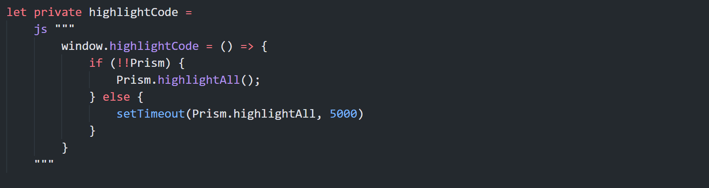
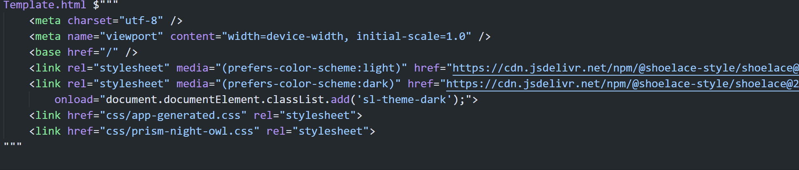

# Html Template

With VSCode plugin and nuget package **Fun.Blazor.HtmlTemplate** we can parse html template nicely at runtime and get intellisense at runtime.

But currently it is not very efficient, so it is not recommend to use it heavily. But it should be ok, because we have adaptive model and runtime cache.

The reason I build this is because for component libraries like shoelacejs, they are web component and it does not have blazor wrapper around it. So to use it, we can auto generate the dom tree at runtime based on the plain string.

Also VSCode has a very cool plugin (Highlight HTML/SQL templates in F#) to make html/js/css language can be embed in fsharp.

{{HtmlTemplateDemo}}